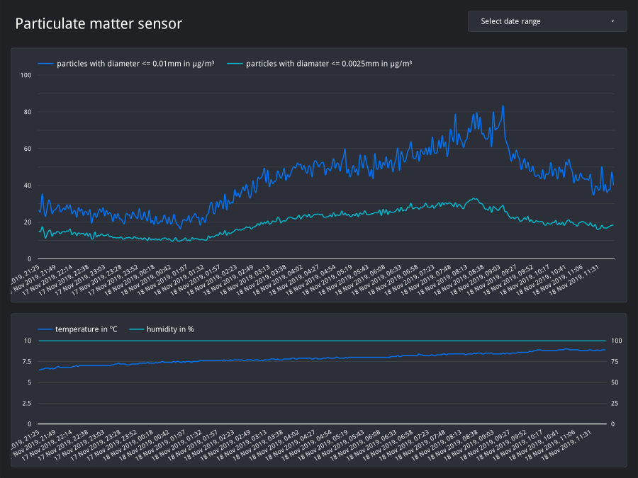

# Particulate Matter Sensor – Store Data in BigQuery

[](https://travis-ci.org/Xennis/particulate-matter-sensor-storage)

The project [luftdaten.info](https://luftdaten.info/en/home-en/) by Code for
Germany enables people to build a particulate matter sensor and [measure the
air qualitiy](https://deutschland.maps.sensor.community/). The firmware that
runs on the sensor has the option to send the data also to an own API.

The [Google Cloud Function](https://cloud.google.com/functions/) stores the sensor
data together with a timestamp in [BigQuery](https://cloud.google.com/bigquery/).
The sensor data in BigQuery can be easily analyzed. As an example a reported
created with Data Studio that access the BigQuery table:




## Setup Cloud Function

### Local Development

Create a virtual environment
```sh
python3 -m venv .venv
source .venv/bin/activate
```

Install the dependencies
```sh
pip install --requirement requirements.txt
```

### Deployment

Deploy the Cloud Function
```sh
make deploy
```

## Setup sensor

### Configuration

* Open the configuration page of the senor
* Enable the option _Send data to own API_ with the settings

    | Optional | Value                                       |
    | ---------|---------------------------------------------|
    | Server   | europe-west1-GCP-PROJECT.cloudfunctions.net |
    | Port     | 80                                          |

Note: The sensor supports HTTPS. HTTP is used because the memory of the NodeMCU
do not can handle larger SSL certificates. ([Source](https://github.com/opendata-stuttgart/meta/wiki/APIs#an-eigene-api-senden))
